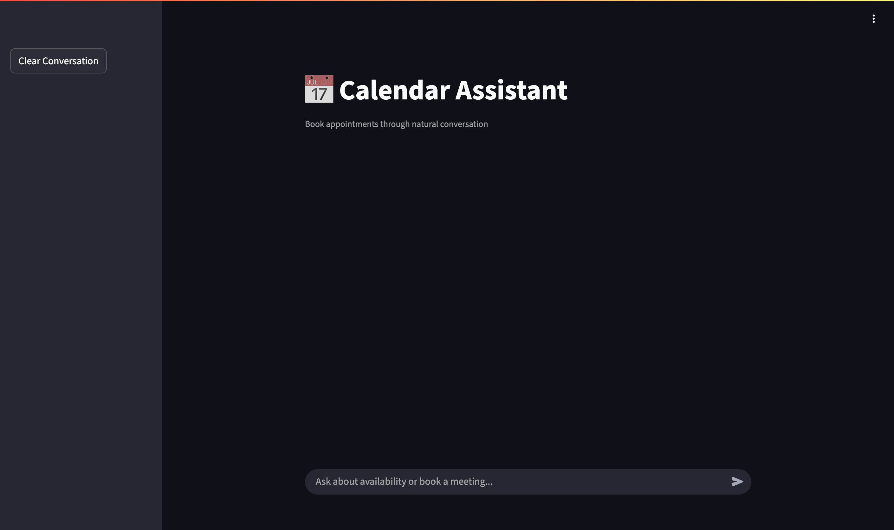

# Calendar Assistant: Conversational AI for Google Calendar



Calendar Assistant is a conversational AI agent that helps users manage their Google Calendar through natural language interactions. Users can book appointments, check availability, and view their schedule using simple chat commands.

## Features

- **Natural Language Interface**: Book appointments using everyday language
- **Calendar Integration**: Direct sync with Google Calendar
- **Smart Scheduling**: Automatic time slot suggestions
- **Multi-timezone Support**: Works globally with proper timezone handling
- **Conversational Memory**: Remembers context within a session
- **Error Recovery**: Graceful handling of misunderstandings

## Technology Stack

### Backend
- **Framework**: FastAPI
- **AI Agent**: Langchain
- **LLM**: Google Gemini
- **Deployment**: Railway

### Frontend
- **Framework**: Streamlit
- **Deployment**: Railway

## Live Demo

[](https://devoted-contentment-production-8f74.up.railway.app/)

## Installation (Local Development)

### Prerequisites
- Python 3.12
- Google Cloud Service Account
- Google Gemini API Key

### 1. Clone Repository
```bash
git clone https://github.com/hkrhasan/calendar-assistant.git
cd calendar-assistant
```

### 2. Set Up Python Environment 
```bash
python -m venv venv
source venv/bin/activate
pip install -r requirements.txt
```

### 3. Configure Environment Variables
Create `.env` file:
```env
GOOGLE_API_KEY=your_gemini_api_key
GOOGLE_CALENDAR_ID=your-calendar-id@group.calendar.google.com
GOOGLE_CREDENTIALS_JSON=your-service-account-cred-base64-string
```

### 4. Run Backend
```bash
chmod +x start-backend.sh
./start-backend.sh
```

### 5. Run Frontend (with new terminal)
```bash
chmod +x start-frontend.sh
./start-frontend.sh
```

---

**Note**: This application requires proper Google Calendar permissions. Ensure your calendar is shared with the service account email address used in the credentials.